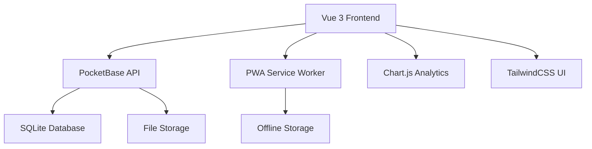

<div align="center">
  
  
  # SiteWise 🏗️
  
  **The Complete Construction Site Management Solution**
  
  *Streamline your construction projects with intelligent site management, real-time collaboration, and comprehensive financial tracking.*
  
  [](https://osaasy.dev/)
  [](https://github.com/site-wise/app/actions/workflows/ci.yml)
  [](https://github.com/site-wise/app/actions/workflows/security.yml)
  [](https://codecov.io/gh/site-wise/app)
  [](http://makeapullrequest.com)
  [](https://discord.gg/YOUR_INVITE_LINK)

  [🚀 **Live Demo**](https://demo.sitewise.in) | [📖 **Documentation**](DOCUMENTATION.md) | [👥 **User Guide**](USER_GUIDE.md) | [💬 **Community**](https://github.com/site-wise/app/discussions)

</div>

---

## ✨ **What is SiteWise?**

SiteWise is a modern, open-source construction site management application that helps construction professionals manage their projects efficiently. Built with Vue 3, TypeScript, and PocketBase, it provides a comprehensive solution for managing items, vendors, services, payments, and team collaboration across multiple construction sites.

### 🎯 **Perfect For:**
- **Site Owners** - Complete project oversight and financial control
- **Supervisors** - Day-to-day operations and quality management  
- **Accountants** - Financial tracking and reporting
- **Teams** - Collaborative project management

---

## 🌟 **Key Features**

<table>
<tr>
<td width="50%" valign="top">

### 🏢 **Multi-Site Management**
- Manage multiple construction sites from one dashboard
- Site-based data isolation for security
- Role-based access control (Owner/Supervisor/Accountant)
- Team invitation and collaboration tools

### 📦 **Smart Inventory**
- Real-time item tracking with quantities
- Delivery history and price trend analysis
- Photo documentation for deliveries
- Vendor comparison and cost optimization

### 🛠️ **Service Management**
- Comprehensive service booking system
- Labor, equipment, and professional services
- Rate management and scheduling
- Completion tracking with photo proof

</td>
<td width="50%" valign="top">

### 💰 **Financial Intelligence**
- Multi-account payment tracking
- Automatic payment allocation
- Outstanding amount monitoring
- Real-time balance calculations

### 📊 **Analytics & Reporting**
- Cost per square foot analysis
- Payment trend visualization
- Vendor performance metrics
- Export capabilities for accounting

### 📱 **Mobile-First Design**
- Progressive Web App (PWA)
- Offline functionality
- Touch-optimized interface
- Camera integration for photos

</td>
</tr>
</table>

---

## 🚀 **Quick Start**

### 🔧 **Prerequisites**

- **Node.js** 20+ 
- **PocketBase** for backend
- Modern web browser

### ⚡ **Installation**

```bash
# Clone the repository
git clone https://github.com/site-wise/app.git
cd app

# Install dependencies
npm install

# Set up environment
cp .env.example .env
# Edit .env with your PocketBase URL

# Start development server
npm run dev
```

🎉 **That's it!** Visit `http://localhost:5173` to see SiteWise in action.

### 🐳 **Docker Deployment (TODO)**

```bash
# Quick start with Docker
docker pull sitewise/app:latest
docker run -p 8080:8080 sitewise/app:latest

# Or build from source
docker build -t sitewise .
docker run -p 8080:8080 sitewise
```

---

## 📸 **Screenshots**

<div align="center">

### 📊 **Dashboard Overview**
*Real-time project metrics and financial insights*


### 📦 **Item Management**
*Track inventory with delivery history and price trends*


### 💳 **Payment Tracking**
*Comprehensive financial management and vendor payments*


</div>

---

## 🏗️ **Architecture**

<div align="center">



</div>

### 🛠️ **Tech Stack**

| Category | Technologies |
|----------|-------------|
| **Frontend** | Vue 3, TypeScript, Vite, TailwindCSS |
| **Backend** | PocketBase, SQLite, Real-time APIs |
| **UI/UX** | Lucide Icons, Chart.js, Responsive Design |
| **Testing** | Vitest, Vue Test Utils, Happy DOM |
| **DevOps** | Docker, GitHub Actions, Automated Deployment |
| **Mobile** | PWA, Service Workers, Offline Support |

---

<!-- ## 🎮 **Try the Demo**

Experience SiteWise with our interactive demo:

🔗 **[Live Demo](https://demo.sitewise.in)** - Full-featured demo environment

**Demo Credentials:**
- **Email:** demo@sitewise.in
- **Password:** demo123

**Sample Data Included:**
- 3 construction sites with different project types
- 50+ items, vendors, and transactions
- Multiple user roles to explore

---
 -->
## 📚 **Documentation**

| Document | Description |
|----------|-------------|
| [📖 **Documentation**](DOCUMENTATION.md) | Complete technical documentation |
| [👥 **User Guide**](USER_GUIDE.md) | End-user manual with screenshots |
| [🤝 **Contributing**](CONTRIBUTING.md) | How to contribute to the project |
| [🔒 **Security**](SECURITY.md) | Security policy and reporting |
| [📋 **Code of Conduct**](CODE_OF_CONDUCT.md) | Community guidelines |

---

## 🚀 **Deployment Options**

### ☁️ **Cloud Platforms (TODO)**
<!-- 
<table>
<tr>
<td align="center">
  <br>
  <strong>AWS</strong><br>
  <a href="#aws-deployment">Deploy Guide</a>
</td>
<td align="center">
  <br>
  <strong>DigitalOcean</strong><br>
  <a href="#digitalocean-deployment">Deploy Guide</a>
</td>
<td align="center">
  <br>
  <strong>Vercel</strong><br>
  <a href="#vercel-deployment">Deploy Guide</a>
</td>
<td align="center">
  <br>
  <strong>Railway</strong><br>
  <a href="#railway-deployment">Deploy Guide</a>
</td>
</tr>
</table> -->

### 🏠 **Self-Hosted (TODO)**

Perfect for organizations requiring complete data control:

- **Docker Compose** - Single-command deployment
- **Kubernetes** - Enterprise-scale orchestration  
- **VPS/Dedicated** - Traditional server deployment

---

## 🌍 **Internationalization**

SiteWise speaks your language:

| Language | Status | Contributor |
|----------|--------|------------|
| 🇺🇸 English | ✅ Complete | Core Team |
| 🇮🇳 Hindi | ✅ Complete | Core Team |
| 🇪🇸 Spanish | 📝 Planned | [Contribute](CONTRIBUTING.md) |
| 🇫🇷 French | 📝 Planned | [Contribute](CONTRIBUTING.md) |
| 🇩🇪 German | 📝 Planned | [Contribute](CONTRIBUTING.md) |

**Want to help translate?** Check our [Internationalization Guide](CONTRIBUTING.md#internationalization).

---

## 🤝 **Contributing**

We love contributions! SiteWise is built by the community, for the community.

### 🌟 **Ways to Contribute**

- 🐛 **Report Bugs** - Help us improve by reporting issues
- ✨ **Suggest Features** - Share your ideas for new functionality  
- 📝 **Improve Docs** - Help others learn and use SiteWise
- 🔧 **Write Code** - Contribute features, fixes, and improvements
- 🌍 **Translate** - Make SiteWise accessible in your language
- 🎨 **Design** - Improve UI/UX and create assets

### 🚀 **Quick Contribution Guide**

1. **Fork** the repository
2. **Clone** your fork locally
3. **Create** a feature branch
4. **Make** your changes
5. **Test** your changes
6. **Submit** a pull request

👀 **First time contributing?** Look for issues labeled [`good first issue`](https://github.com/site-wise/app/labels/good%20first%20issue).

### 🏆 **Contributors**

Thanks to these amazing people who have contributed to SiteWise:

<a href="https://github.com/site-wise/app/graphs/contributors">
  
</a>

---

## 📊 **Project Stats**

<div align="center">


</div>

<table>
<tr>
<td align="center"><strong>⭐ Stars</strong><br>Give us a star if you like SiteWise!</td>
<td align="center"><strong>🐛 Issues</strong><br>Found a bug? Report it!</td>
<td align="center"><strong>💡 Ideas</strong><br>Have a feature idea? Share it!</td>
<td align="center"><strong>🔀 PRs</strong><br>Contributions are welcome!</td>
</tr>
</table>

---

## 🔒 **Security**

Security is our top priority. SiteWise implements:

- 🔐 **JWT Authentication** with secure token management
- 🛡️ **Role-based Access Control** with site isolation
- 🔒 **Data Encryption** in transit and at rest
- 🚨 **Security Scanning** with automated vulnerability detection
- 📋 **Regular Audits** of dependencies and code

**Found a security issue?** Please report it responsibly via [security@sitewise.in](mailto:security@sitewise.in).

See our [Security Policy](SECURITY.md) for more details.

---

## 📈 **Roadmap**

### 🎯 **Current Focus (Q3 2025)**
- [ ] Advanced reporting and analytics dashboard
- [ ] Mobile app for iOS and Android
- [ ] API for third-party integrations
- [ ] Enhanced photo management with AI tagging

### 🚀 **Upcoming Features (Q4 2025)**
- [ ] Real-time collaboration tools
- [ ] Advanced workflow automation
- [ ] Integration with accounting software (Tally)
- [ ] Project timeline and Gantt charts
- [ ] Budget forecasting and variance analysis

### 🔮 **Future Vision (2026+)**
- [ ] AI-powered cost estimation
- [ ] IoT device integration for equipment tracking
- [ ] Blockchain-based contract management
- [ ] Advanced machine learning insights

**Want to influence our roadmap?** Join our [discussions](https://github.com/site-wise/app/discussions) and share your ideas!

---

## 💬 **Community**

Join our vibrant community of construction professionals and developers:

### 🌐 **Connect With Us**

<table>
<tr>
<td align="center">
  <a href="https://github.com/site-wise/app/discussions">
    <br>
    <strong>GitHub Discussions</strong>
  </a>
</td>
<td align="center">
  <a href="https://discord.gg/YOUR_INVITE_LINK">
    <br>
    <strong>Discord Server (TODO)</strong>
  </a>
</td>
<td align="center">
  <a href="https://twitter.com/sitewise_app">
    <br>
    <strong>Twitter</strong>
  </a>
</td>
<!-- <td align="center">
  <a href="https://linkedin.com/company/sitewise">
    <br>
    <strong>LinkedIn</strong>
  </a>
</td> -->
</tr>
</table>

### 📊 **Community Stats**

- 👥 **500+** Active users across 50+ countries
- 🏗️ **1000+** Construction sites managed
- 💰 **$10M+** In project value tracked
- 🌍 **15** Languages and growing

---

## 🏆 **Recognition (TO HAPPEN!)**

SiteWise has been recognized by:

<!-- - 🥇 **Open Source Construction Software of the Year 2024** - BuildTech Awards
- 🌟 **Top 10 Construction Management Tools** - ConstructionDive
- 🚀 **Most Promising Startup** - TechCrunch Construction Summit -->

---

## 📞 **Support**

Need help? We're here for you:

| Support Type | Contact | Response Time |
|-------------|---------|---------------|
| 🐛 **Bug Reports** | [GitHub Issues](https://github.com/site-wise/app/issues) | 24-48 hours |
| ❓ **Questions** | [GitHub Discussions](https://github.com/site-wise/app/discussions) | 12-24 hours |
| 🔒 **Security** | security@sitewise.in | 4-8 hours |
| 💼 **Business** | hello@sitewise.in | 1-2 business days |

See our [Support Guide](SUPPORT.md) for more detailed information.

---

## 📄 **License**

SiteWise is proudly open source and available under the [O'Saasy License](LICENSE).

```
O'Saasy License - see the LICENSE file for details.
Copyright (c) 2025 SiteWise
```

---

## 🙏 **Acknowledgments**

SiteWise wouldn't be possible without these amazing open-source projects:

- [Vue.js](https://vuejs.org/) - The Progressive JavaScript Framework
- [PocketBase](https://pocketbase.io/) - Open Source backend in 1 file
- [TailwindCSS](https://tailwindcss.com/) - A utility-first CSS framework
- [Vite](https://vitejs.dev/) - Next generation frontend tooling
- [TypeScript](https://www.typescriptlang.org/) - JavaScript with syntax for types

And a special thanks to all our [contributors](https://github.com/site-wise/app/graphs/contributors) who make SiteWise better every day! 🎉

---

<div align="center">

**⭐ If SiteWise helps you manage your construction projects better, please give us a star! ⭐**

**Made with ❤️ by the SiteWise community**

[🏠 Website](https://sitewise.in) • [📖 Docs](DOCUMENTATION.md) • [💬 Community](https://github.com/site-wise/app/discussions) • [🐛 Issues](https://github.com/site-wise/app/issues) • [🚀 Contribute](CONTRIBUTING.md)

</div>