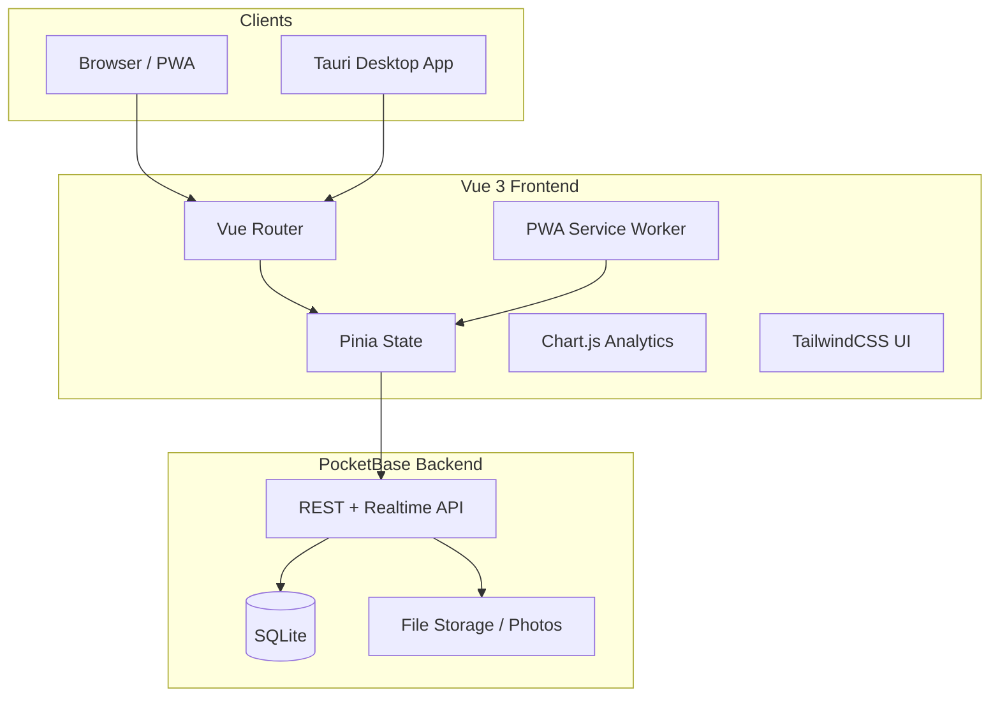

<div align="center">
  

  # SiteWise 🏗️

  ### Run your construction sites like software.

  **Open-source, mobile-first, self-hostable site management — for the people who actually run the job.**

  *Track every delivery, vendor, payment, and rupee across one site or fifty. Installs on your phone as an app. Ships as a native desktop app. Your data, your server.*

  [](https://osaasy.dev/)
  [](https://github.com/site-wise/app/actions/workflows/ci.yml)
  [](https://github.com/site-wise/app/actions/workflows/security.yml)
  [](https://codecov.io/gh/site-wise/app)
  [](http://makeapullrequest.com)

  [🚀 **Sign Up Free**](https://sitewise.in) • [👥 **User Guide**](USER_GUIDE.md) • [🤝 **Contributing**](CONTRIBUTING.md) • [💬 **Discussions**](https://github.com/site-wise/app/discussions)

</div>

---

## ✨ What is SiteWise?

Construction runs on a thousand small facts: *which vendor delivered what, on which date, for how much — and have we paid them yet?* Most of that lives in notebooks, WhatsApp, and someone's head.

**SiteWise puts it in one place.** It's a modern, open-source construction site management app that handles both the **operations** (items, deliveries, vendors, services) and the **finances** (payments, accounts, outstanding balances, quotations) of real construction sites — built mobile-first so it works from the site, not just the back office.

It's a Progressive Web App you can install on any phone, it works offline, and it also ships as a **native desktop app via Tauri**. The backend is [PocketBase](https://pocketbase.io/) — a single binary you can run anywhere — so self-hosting is genuinely easy and your data stays yours.

### 🎯 Built for the whole site team

| Role | What they get |
|------|---------------|
| 👷 **Owners** | Full oversight across every site, finance-grade tracking, team control |
| 🧰 **Supervisors** | Fast on-site delivery logging, photo proof, day-to-day operations |
| 🧮 **Accountants** | Payment allocation, account balances, outstanding monitoring, exports |

---

## 🌟 Features

Everything below is in the app today.

<table>
<tr>
<td width="50%" valign="top">

### 🏢 Multi-Site Management
Run multiple construction sites from one account with **strict per-site data isolation**. Switch sites and every view re-scopes its data reactively — no leaks, no mixups.

### 👥 Roles & Team
Three calculated permission roles — **Owner**, **Supervisor**, **Accountant**. Invite teammates and manage who can see and do what, per site.

### 📦 Items & Inventory
A catalog with units and tags, plus rich **item detail pages**: full delivery history, **unit-price trend charts**, price range (low / average / high), and total quantity delivered — so you always know if you're overpaying.

### 🚚 Deliveries
Log **multi-item deliveries** with vendor, date, reference, and **photo documentation** straight from the camera. Browse proof in a full-screen, swipeable gallery, and track payment status per delivery.

### 🏪 Vendors & Returns
A vendor directory backed by detailed vendor pages with **running balances** (amount due / advance held) and a complete **returns & refunds** workflow for what goes back.

</td>
<td width="50%" valign="top">

### 💰 Payments & Accounts
SiteWise's most powerful surface. Track payments across **multiple accounts**, **automatically allocate** a single payment across deliveries, monitor outstanding amounts, and watch balances recalculate in real time. Drill into any account's detail page.

### 🧾 Quotations
Create and manage vendor **quotations** to compare and lock in pricing before you commit.

### 🛠️ Services & Bookings
Book labor, equipment, and professional **services** — manage rates, schedule work, and track completion with photo proof. Service detail pages keep the history.

### 📊 Analytics Dashboard
Real-time metrics with **Chart.js** visualizations: cost analysis, payment-trend charts, and vendor performance — turning raw entries into decisions.

### 🧰 Tools, Docs & Export
Built-in utilities including a **time calculator**, plus document tooling: **PDF generation** (jsPDF), in-app **PDF viewing** (pdf.js), and **bulk export / zip** (JSZip) for handing data to your accountant.

</td>
</tr>
</table>

<details>
<summary><strong>📱 …and the polish layer that makes it pleasant to actually use</strong></summary>

<br>

- **Installable PWA** — add to home screen, works offline, camera capture for delivery photos
- **Native desktop app** — packaged with Tauri for Windows / macOS / Linux
- **Subscription system** — tiered plans with usage limits (items, vendors, deliveries, and more), unlimited (`-1`) plan support, and usage-aware gating on create actions
- **Onboarding & guided tours** — a new-user onboarding flow plus interactive product tours (driver.js)
- **Light & dark theme**
- **Keyboard shortcuts** — `Shift+Alt+N` to create, `Esc` to close modals, and more
- **Mobile-native feel** — bottom navigation, pull-to-refresh, skeleton loaders, toast notifications
- **Internationalization** — full **English** and **Hindi** translations

</details>

---

## 🚀 Quick Start

### Prerequisites

- **Node.js 20+**
- A running **[PocketBase](https://pocketbase.io/)** instance (the backend — a single downloadable binary)
- A modern web browser

### Get it running

```bash
# 1. Clone the repository
git clone https://github.com/site-wise/app.git
cd app

# 2. Install dependencies
npm install

# 3. Set up your environment
cp .env.example .env
# Edit .env and point VITE_POCKETBASE_URL at your PocketBase instance

# 4. Start the dev server
npm run dev
```

🎉 Visit **http://localhost:5173** and you're in.

### Run as a desktop app

```bash
npm run dev:tauri      # native desktop app in dev mode
npm run build:tauri    # produce a distributable desktop build
```

### Useful scripts

| Script | What it does |
|--------|--------------|
| `npm run dev` | Vite dev server (web / PWA) |
| `npm run dev:tauri` | Native desktop app (dev) |
| `npm run build` | Type-check + production web build |
| `npm run build:tauri` | Build the native desktop app |
| `npm test` | Run the test suite (Vitest) |
| `npm run test:ui` | Vitest interactive UI |
| `npm run test:coverage` | Tests with coverage report |
| `npm run lint` | Lint the codebase |
| `npm run preview` | Preview the production build |

> **Don't want to self-host?** [Sign up free at sitewise.in](https://sitewise.in) — no install required, start managing your sites in minutes.

---

## 🏗️ Architecture

SiteWise is a Vue 3 single-page app talking to a PocketBase backend over REST + realtime. The same frontend ships three ways: in the browser, as an installable PWA, and as a Tauri desktop app.


```mermaid
graph TB
    subgraph Clients
      W[Browser / PWA]
      D[Tauri Desktop App]
    end

    subgraph "Vue 3 Frontend"
      R[Vue Router]
      P[Pinia State]
      C[Chart.js Analytics]
      T[TailwindCSS UI]
      SW[PWA Service Worker]
    end

    subgraph "PocketBase Backend"
      API[REST + Realtime API]
      DB[(SQLite)]
      FS[File Storage / Photos]
    end

    W --> R
    D --> R
    R --> P
    P --> API
    SW --> P
    API --> DB
    API --> FS
```

### 🛠️ Tech Stack

| Category | Technologies |
|----------|-------------|
| **Frontend** | Vue 3, TypeScript, Vite, TailwindCSS |
| **State & Routing** | Pinia, Vue Router |
| **Backend** | PocketBase (single binary, SQLite-backed) with realtime |
| **Charts & Icons** | Chart.js + vue-chartjs, Lucide |
| **Documents** | jsPDF (generation), pdf.js (viewing), JSZip (bulk export) |
| **UX** | driver.js (tours), vue-toastification, vite-plugin-pwa |
| **Desktop** | Tauri |
| **Testing** | Vitest, Vue Test Utils, Happy DOM |
| **CI / Quality** | GitHub Actions, Codecov |

---

## 📚 Documentation

| Document | Description |
|----------|-------------|
| [👥 **User Guide**](USER_GUIDE.md) | End-user manual |
| [🤝 **Contributing**](CONTRIBUTING.md) | How to contribute to the project |
| [🔒 **Security**](SECURITY.md) | Security policy and responsible disclosure |
| [📋 **Code of Conduct**](CODE_OF_CONDUCT.md) | Community guidelines |
| [📋 **Code of Conduct**](CODE_OF_CONDUCT.md) | Community guidelines |

---

## 🌍 Internationalization

SiteWise ships with two complete, first-class languages. More are welcome — translations live in `src/locales`, and every visible string must exist as a key in **both** `en.json` and `hi.json`.

| Language | Status |
|----------|--------|
| 🇬🇧 English | ✅ Complete |
| 🇮🇳 Hindi | ✅ Complete |
| 🌐 Your language | 📝 Help wanted — [contribute a locale](CONTRIBUTING.md) |

---

## 🔒 Security

Security and tenant isolation are core to SiteWise:

- 🔐 **Authentication** via PocketBase's auth system with secure token handling
- 🛡️ **Role-based access control** — Owner / Supervisor / Accountant, with permissions calculated per role
- 🏢 **Strict per-site data isolation** — every service filters by the current site, and `getById` lookups validate site ownership to prevent cross-site access
- 🚨 **Automated security scanning** in CI

**Found a vulnerability?** Please report it responsibly to [security@sitewise.in](mailto:security@sitewise.in). See our [Security Policy](SECURITY.md) for details.

---

## 🤝 Contributing

SiteWise is built in the open, and contributions of every size are welcome.

- 🐛 **Report bugs** — open an [issue](https://github.com/site-wise/app/issues)
- ✨ **Suggest features** — start a [discussion](https://github.com/site-wise/app/discussions)
- 📝 **Improve docs** — clearer docs help everyone
- 🔧 **Write code** — features, fixes, refactors
- 🌍 **Translate** — bring SiteWise to a new language
- 🎨 **Design** — sharpen the UI/UX

### Quick contribution flow

1. **Fork** the repo and **clone** your fork
2. **Branch** off `main`
3. **Make** your change (add new strings to *both* `en.json` and `hi.json`)
4. **Test** with `npm test`
5. **Open** a pull request

👀 New here? Look for issues labeled [`good first issue`](https://github.com/site-wise/app/labels/good%20first%20issue). Read [CONTRIBUTING.md](CONTRIBUTING.md) before you start.

### Contributors

<a href="https://github.com/site-wise/app/graphs/contributors">
  
</a>

---

## 📈 Roadmap

Forward-looking and shaped by the community — these are directions, not promises with dates.

**🔜 Now**
- [ ] Expand automated test coverage across views
- [ ] Documented self-host / deployment guide
- [ ] Deeper analytics on the dashboard

**🛠️ Next**
- [ ] More export formats and accounting-friendly reports
- [ ] Additional language translations
- [ ] Richer photo management

**🔮 Later**
- [ ] Integrations with popular accounting tools
- [ ] Project timeline / scheduling views
- [ ] Budget forecasting and variance analysis

**Want to influence the roadmap?** Join the [discussions](https://github.com/site-wise/app/discussions).

---

## 📞 Support

| Need | Where to go |
|------|-------------|
| 🐛 **Bug reports** | [GitHub Issues](https://github.com/site-wise/app/issues) |
| ❓ **Questions & ideas** | [GitHub Discussions](https://github.com/site-wise/app/discussions) |
| 🔒 **Security** | [security@sitewise.in](mailto:security@sitewise.in) |
| 💼 **Business inquiries** | [hello@sitewise.in](mailto:hello@sitewise.in) |

---

## 📄 License

SiteWise is open source under the [O'Saasy License](LICENSE).

```
O'Saasy License — see the LICENSE file for details.
Copyright (c) 2025 SiteWise
```

---

## 🙏 Acknowledgments

SiteWise stands on the shoulders of excellent open-source projects:

- [Vue.js](https://vuejs.org/) — the progressive JavaScript framework
- [PocketBase](https://pocketbase.io/) — open-source backend in a single file
- [Tauri](https://tauri.app/) — tiny, secure native desktop apps
- [TailwindCSS](https://tailwindcss.com/) — utility-first CSS
- [Vite](https://vitejs.dev/) — next-generation frontend tooling
- [TypeScript](https://www.typescriptlang.org/) — JavaScript with types
- [Chart.js](https://www.chartjs.org/) — flexible charting

…and everyone who [contributes](https://github.com/site-wise/app/graphs/contributors) to making SiteWise better. 🎉

---

<div align="center">

**⭐ If SiteWise helps you run your sites better, give it a star — it genuinely helps. ⭐**

[🏠 Website](https://sitewise.in) • [🚀 Sign Up Free](https://sitewise.in) • [👥 User Guide](USER_GUIDE.md) • [💬 Discussions](https://github.com/site-wise/app/discussions) • [🐛 Issues](https://github.com/site-wise/app/issues) • [🤝 Contribute](CONTRIBUTING.md)

</div>
